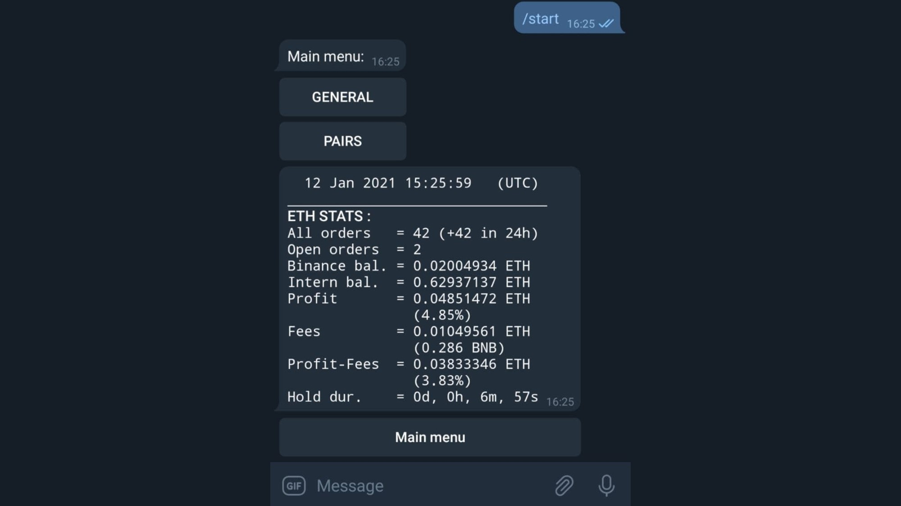
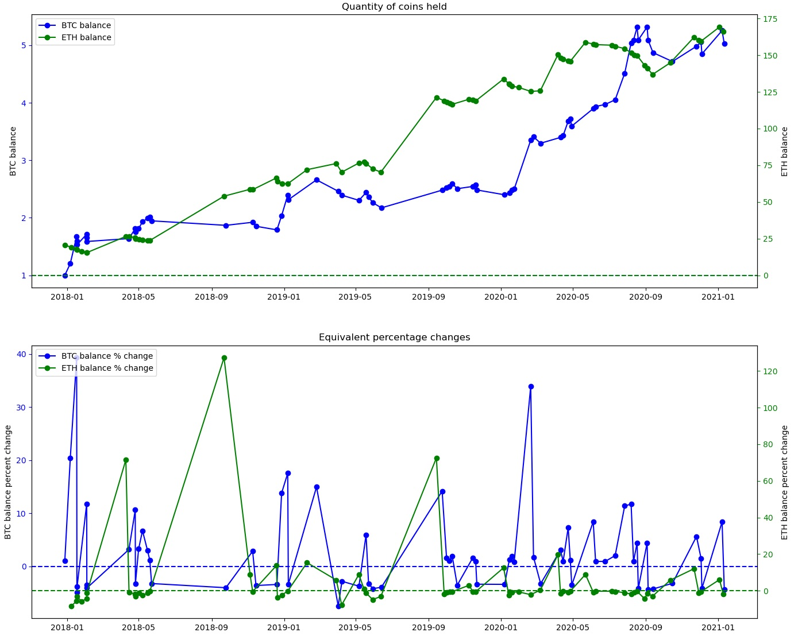

# AlgoTrading
------------

This personal project implements the necessary functionalities to engage in 24/7 crypto algorithmic trading on Binance.

## Features

- [x] **Written in Python 3.8+**
- [x] **Persistence**: Persistence is achieved through sqlite.
- [x] **Paper-Trading**: Run the bot without playing money.
- [x] **Agility**: Trade on all possible pairs on multiple quotes at the same time (ETH and BTC for example).
- [x] **Timeframes**: Trade on timeframes from one minute to daily data.
- [x] **Backtesting**: Run a simulation of a buy/sell strategy on a specific pair and plot the results.
- [x] **Strategy templates**: The project comes with build-in strategies that the user can fine-tune.
- [x] **Strategy Optimization**: Use an Optuna optimization to search for the best parameters combination for your strategy.
- [x] **Dashboard GUI**: Monitor the performances of the bot through an elegant Dash GUI.
- [x] **Telegram Interface**: Provide a performance status of your current trades.
- [x] **Speed**: Multiprocessing is implemented across the algo to speed it up.

**New** : run `/experimentations/live_orderbook.py` to display the orderbook in real time via Binance's websocket, along with the evolution of imbalance value and the price.

## Trading

Connection to Binance :
- [Create an API key](https://www.binance.com/fr/support/faq/360002502072) in your Binance user profile;
- In `/assets`: store your Binance API key in `credentials.txt`

Connection to Telegram (optional):
- Configure a bot by [talking to the BotFather](https://core.telegram.org/bots);
- In `/assets`: store your Telegram credentials in `telegram_config.cfg`

Trading can be entirely managed from `Trading.py`.
Additionally, run `Dashboard.py` to display a live dashboard (GUI) to get performance metrics, and `Telegram_interface.py` to get a Telegram interface.

## Backtesting

Backtest a strategy using one of the pre-filled templates in `backtesting/backtesting.py`.

Example output of the backtesting script, simulating a strategy on the ETHBTC pair on the 1h timeframe, using a 3% stop-loss:

`BTC profits = 402.4%`
`Winning trades : 86 (63%)`
`Losing trades  : 50 (36%)`
`Max drawdown : -11.3%`

## Structure

The code is organized as follows :
- `Trading.py`: Manages the 24/7 trading process.
- `Dashboard.py`: GUI to have metrics on the algo's behavior.
- `Telegram_interface.py`: run the file and send `/start` to the telegram bot from telegram.
- `Database.py`: Manages the databases. One database for paper trading, another for live trading.
- `Echange.py`: Manages the interface with Binance's REST API.
- `Helpers.py`: Helper methods.
- `/assets`: stores the databases, some useful files, and the Binance and Telegram credentials.
- `/backtesting`: Multiple scripts to backtest strategies.
- `/experimentations`: Files in progress to test personal ideas.

## In Progress

- Investigating minute timeframe strategies

## To-Do

The project is still in its development phase and the code evolves rapidly. 
- Handle the event when the user withdraws or deposits a quote while the bot is running
- Create a simple GUI for `Trading.py`
- Create a GUI for `backtesting.py`
- Investigate orderbook imbalance strategies

## Disclaimer

This software is for educational purposes only. Do not risk money which
you are afraid to lose. USE THE SOFTWARE AT YOUR OWN RISK. THE AUTHOR ASSUMES NO RESPONSIBILITY FOR YOUR TRADING RESULTS.

Always start by running the algo in paper-trading mode and do not engage money
before you understand how it works and what profit/loss you should expect.